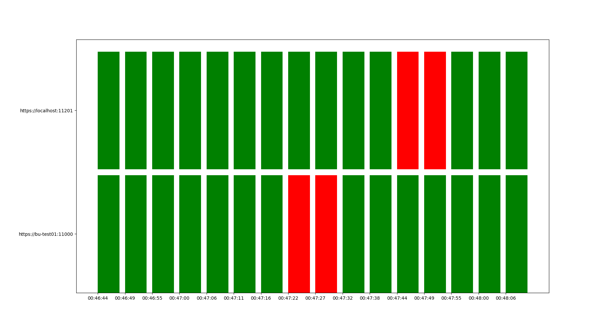

# endpoint-checker

## installation

```bash
venv env
source env/bin/activate
pip install -r requirements.txt
```

## execution

```bash
python3 main.py https://bu-prod02:10200 https://bu-prod02:10000 https://bu-prod01:10200 https://bu-prod01:10000 https://b2b.otto.de  2> /dev/null > responses.csv
```


